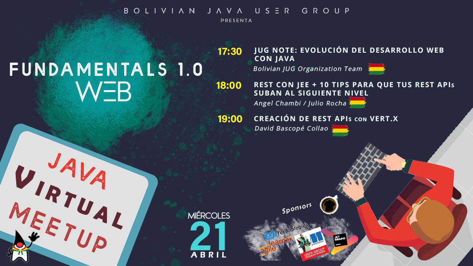
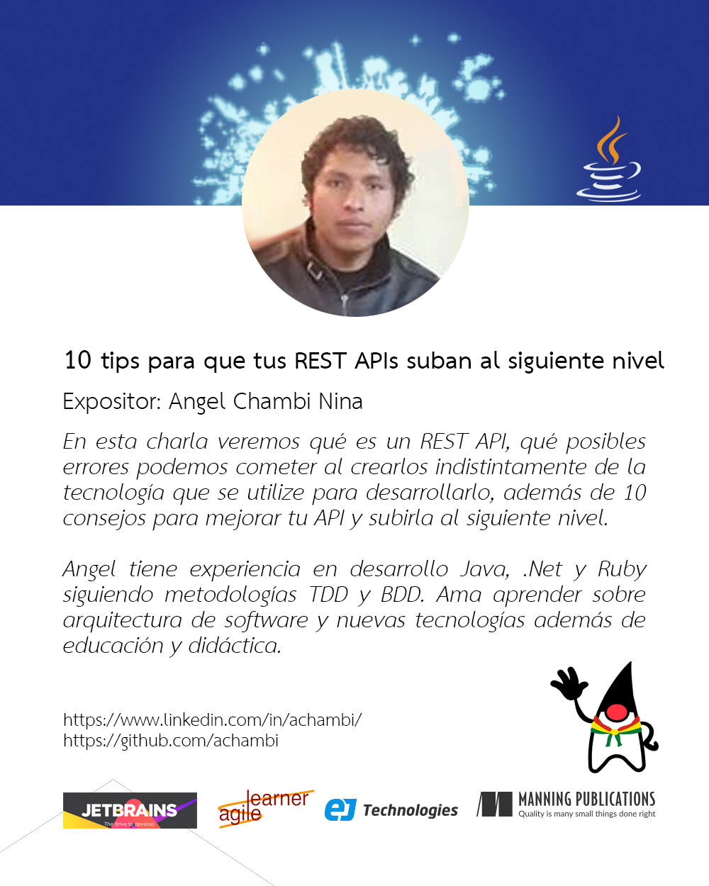
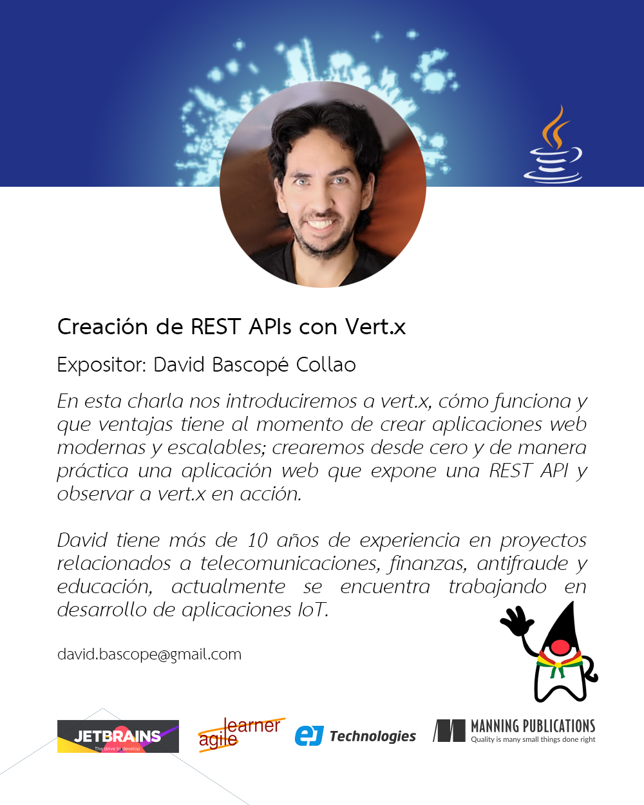

# MeetUp Abril 2021

- Para volver a ver el evento haz click aquí:

## Conoce a los expositores:
- Los slides de la charla de Angel, **10 tips para que tus APIs suban al siguiente nivel** está en este [link.](https://drive.google.com/file/d/1iC0p5jnK3FjiKXN4PljZ5MR2qY-NT7eU/view?usp=sharing)

  

- Los slides de la charla de David, **Creación de Rest APIs con VERT.X** está en este [link.](https://drive.google.com/file/d/1aOQRGzZaRyBK7ZZ4G784LpWsp4WUQbbW/view?usp=sharing)
   Y también el código de los ejemplos puede ser encontrado [aqui.](https://github.com/bascopedavid/vertx-tasks)

 
 